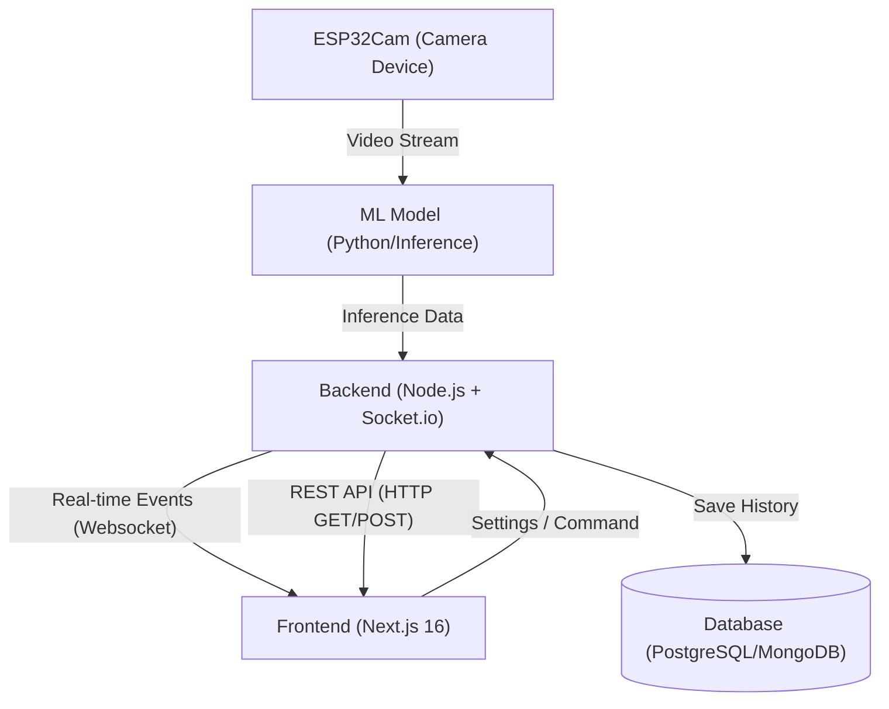

# Panduan Integrasi Backend & Dokumen Deployment - SocaSob

Dokumen ini menjelaskan seluruh bagian frontend dari proyek **SocaSob** yang harus diintegrasikan dengan backend, serta panduan langkah demi langkah untuk melakukan deployment ke production.

---

## 🏗️ Gambaran Arsitektur Sistem

Aplikasi SocaSob terdiri dari tiga komponen utama:
1. **Frontend (Next.js 16)**: Antarmuka pengguna untuk memantau data real-time, melihat riwayat (log), dan resume kesehatan mata.
2. **Backend (Node.js/Express + Socket.io)**: Mengelola REST API, menyalurkan data real-time via WebSockets, dan mengelola persistensi database.
3. **ESP32Cam & ML Pipeline**: Mengalirkan video dari kamera perangkat ke model Machine Learning (ML) untuk mendeteksi jarak mata, dan mengirim hasilnya ke backend.



---

## 🔌 Bagian 1: Titik Integrasi Real-Time (Socket.io)

Frontend sudah memiliki integrasi Socket.io client melalui React Context. Anda hanya perlu menyamakan event dan format payload di backend.

### 📍 File Pendukung Frontend
* [socket-context.tsx](file:///c:/Users/IPGAMING/Downloads/socasob-frontend-project/lib/socket-context.tsx): File utama tempat inisialisasi socket client dan penanganan event.
* [timer-display.tsx](file:///c:/Users/IPGAMING/Downloads/socasob-frontend-project/components/timer-display.tsx): Mengonsumsi data waktu dan status mata real-time.
* [eye-metrics.tsx](file:///c:/Users/IPGAMING/Downloads/socasob-frontend-project/components/eye-metrics.tsx): Mengonsumsi data jarak mata dan tingkat risiko/fatigue real-time.

### 📥 Event yang Harus Dikirim oleh Backend (Server-to-Client)

#### 1. Koneksi Socket Terbentuk (`connect`)
* **Trigger**: Saat frontend berhasil melakukan handshake dengan server backend.
* **Tindakan**: Mengubah status koneksi di pojok kanan atas layar (`isConnected` menjadi `true`).

#### 2. Pembaruan Timer (`timer-update`)
* **Trigger**: Dikirim setiap **1 detik** oleh server saat sesi monitoring berjalan.
* **Payload**:
  ```json
  {
    "hours": 0,
    "minutes": 45,
    "seconds": 12,
    "timestamp": "2026-06-20T07:15:00Z"
  }
  ```

#### 3. Deteksi Jarak Mata (`eye-distance`)
* **Trigger**: Dikirim setiap kali model ML mendeteksi perubahan jarak wajah pengguna ke layar.
* **Payload**:
  ```json
  {
    "distance": "Dekat" | "Jauh",
    "confidence": 94.5,
    "timestamp": "2026-06-20T07:15:01Z"
  }
  ```
  > [!NOTE]
  > * `"Dekat"` didefinisikan jika jarak < 30 cm (akan memicu peringatan merah di UI).
  > * `"Jauh"` didefinisikan jika jarak >= 30 cm (status normal / aman, berwarna hijau di UI).

#### 4. Status Kesehatan Mata (`eye-status`)
* **Trigger**: Hasil pengolahan backend mengenai kondisi kelelahan mata atau risiko miopia.
* **Payload**:
  ```json
  {
    "status": "normal" | "risk_myopia" | "risk_fatigue" | "disconnected",
    "score": 85,
    "indicators": {
      "eyeFatigue": 20,
      "myopiaRisk": 10,
      "posureWarning": false,
      "blinkRate": 16
    },
    "timestamp": "2026-06-20T07:15:02Z"
  }
  ```

---

## 🌐 Bagian 2: Titik Integrasi REST API (HTTP Request)

Saat ini, beberapa halaman di frontend masih menggunakan data statis (mock data). Anda perlu mengimplementasikan endpoint berikut di backend dan melakukan `fetch()` di frontend.

### 1. Halaman Log Riwayat Monitoring
* **File Frontend**: [app/log/page.tsx](file:///c:/Users/IPGAMING/Downloads/socasob-frontend-project/app/log/page.tsx)

#### A. GET `/api/log/today`
* **Deskripsi**: Mengambil durasi tatap dekat dan tatap jauh pengguna untuk hari ini.
* **Payload Respons (200 OK)**:
  ```json
  {
    "date": "2026-06-20",
    "durationsShort": 5,
    "durationsLong": 2
  }
  ```
* **Integrasi Frontend**: Ubah variabel `mockDailyLog` pada file log page untuk fetch data dari endpoint ini.

#### B. GET `/api/log/weekly`
* **Deskripsi**: Mengambil riwayat status monitoring selama 7 hari terakhir.
* **Payload Respons (200 OK)**:
  ```json
  [
    { "date": "20 Juni 2026", "status": "normal" },
    { "date": "19 Juni 2026", "status": "risk_myopia" },
    { "date": "18 Juni 2026", "status": "risk_myopia" },
    { "date": "17 Juni 2026", "status": "normal" },
    { "date": "16 Juni 2026", "status": "normal" },
    { "date": "15 Juni 2026", "status": "normal" },
    { "date": "14 Juni 2026", "status": "risk_fatigue" }
  ]
  ```
* **Integrasi Frontend**: Ganti `mockWeeklyHistory` dengan hasil pemanggilan API ini.

---

### 2. Halaman Resume Kesehatan (6 Bulan)
* **File Frontend**: [app/resume/page.tsx](file:///c:/Users/IPGAMING/Downloads/socasob-frontend-project/app/resume/page.tsx)

#### GET `/api/resume`
* **Deskripsi**: Mengambil rangkuman metrik kesehatan mata pengguna dalam kurun waktu 6 bulan terakhir.
* **Payload Respons (200 OK)**:
  ```json
  {
    "eyeHealthScore": 84,
    "myopiaRisk": "Rendah",
    "fatigueRisk": "Sedang",
    "averageDistance": 57,
    "restCompliance": 89,
    "totalHours": 245,
    "distribution": {
      "closDistance": 35,
      "farDistance": 65
    }
  }
  ```
* **Integrasi Frontend**: Ganti data statis skor (84), tingkat risiko, rata-rata jarak, persentase kepatuhan, total jam, dan grafik distribusi agar bernilai dinamis sesuai respons API.

---

### 3. Halaman Pengaturan (Settings)
* **File Frontend**: [app/settings/page.tsx](file:///c:/Users/IPGAMING/Downloads/socasob-frontend-project/app/settings/page.tsx)

#### A. POST `/api/robot/connect`
* **Deskripsi**: Menghubungkan atau menguji koneksi backend ke perangkat ESP32Cam menggunakan IP Address.
* **Payload Request**:
  ```json
  {
    "ipAddress": "192.168.1.100"
  }
  ```
* **Payload Respons (200 OK)**:
  ```json
  {
    "success": true,
    "message": "Connected successfully",
    "device": {
      "id": "ESP32CAM-001",
      "status": "online"
    }
  }
  ```
* **Integrasi Frontend**: Panggil API ini di dalam fungsi `handleConnect` sebelum mengubah state `isConnected` menjadi `true`.

#### B. POST `/api/settings`
* **Deskripsi**: Menyimpan pengaturan suara (volume) dan notifikasi pengguna ke backend agar persisten antar perangkat.
* **Payload Request**:
  ```json
  {
    "volume": 70,
    "notificationsEnabled": true,
    "ipAddress": "192.168.1.100"
  }
  ```
* **Integrasi Frontend**: Integrasikan di dalam fungsi `saveSettings` agar selain disimpan di `localStorage` juga dikirimkan ke server backend.

---

## ⚙️ Bagian 3: Konfigurasi Environment Variables

Sebelum mendeploy aplikasi frontend, Anda wajib mengatur environment variable agar client tahu ke alamat server mana ia harus terhubung.

Buat file `.env.local` (untuk development) atau daftarkan pada panel hosting Anda (untuk production):

```env
# URL server backend Socket.io dan REST API
NEXT_PUBLIC_SOCKET_URL=http://localhost:3001
```

> [!WARNING]
> Jangan pernah membocorkan URL API sensitif ke repository git umum. Pastikan `.env.local` atau `.env.production.local` masuk ke dalam file `.gitignore`.

---

## 🚀 Bagian 4: Panduan Deployment Frontend

Berikut adalah 3 opsi deployment yang dapat dipilih sesuai dengan infrastruktur server Anda.

### Opsi A: Deployment Vercel (Direkomendasikan & Paling Mudah)
Next.js terintegrasi penuh dengan Vercel secara native.

1. **Install Vercel CLI & Login**:
   ```bash
   npm i -g vercel
   vercel login
   ```
2. **Hubungkan Project**:
   Jalankan perintah berikut di direktori root `socasob-frontend-project`:
   ```bash
   vercel link
   ```
3. **Tambahkan Environment Variable**:
   Tambahkan URL backend Anda ke dalam konfigurasi Vercel:
   ```bash
   vercel env add NEXT_PUBLIC_SOCKET_URL
   # Masukkan nilai URL backend production (contoh: https://api.socasob.com)
   ```
4. **Deploy ke Production**:
   ```bash
   vercel --prod
   ```

---

### Opsi B: Menggunakan Docker (Self-Hosted / Cloud VPS)
Jika Anda menggunakan server sendiri dan ingin menggunakan containerization.

#### 1. Buat file `Dockerfile` di direktori root:
```dockerfile
# Dockerfile
FROM node:18-alpine AS deps
WORKDIR /app
COPY package.json package-lock.json ./
RUN npm install

FROM node:18-alpine AS builder
WORKDIR /app
COPY --from=deps /app/node_modules ./node_modules
COPY . .
# Set Env untuk Build Time
ARG NEXT_PUBLIC_SOCKET_URL
ENV NEXT_PUBLIC_SOCKET_URL=$NEXT_PUBLIC_SOCKET_URL
RUN npm run build

FROM node:18-alpine AS runner
WORKDIR /app
ENV NODE_ENV production
COPY --from=builder /app/public ./public
COPY --from=builder /app/.next/standalone ./
COPY --from=builder /app/.next/static ./.next/static

EXPOSE 3000
ENV PORT 3000
CMD ["node", "server.js"]
```

#### 2. Jalankan Build & Run Docker Container:
```bash
docker build -t socasob-frontend --build-arg NEXT_PUBLIC_SOCKET_URL=https://api.socasob.com .
docker run -d -p 3000:3000 --name socasob-app socasob-frontend
```

---

### Opsi C: Deployment VPS Tradisional (PM2 + Nginx)
Cocok untuk deployment di Ubuntu/Debian VPS.

#### 1. Clone & Build Aplikasi di Server:
```bash
git clone <url-repository-anda>
cd socasob-frontend-project
npm install
# Buat file konfigurasi env production
echo "NEXT_PUBLIC_SOCKET_URL=https://api.socasob.com" > .env.production
npm run build
```

#### 2. Jalankan Server Menggunakan PM2 (Process Manager):
```bash
npm install -g pm2
pm2 start npm --name "socasob-frontend" -- start
pm2 save
pm2 startup
```

#### 3. Konfigurasi Nginx Reverse Proxy & HTTP/WebSocket Upgrade:
Edit file nginx block server Anda (biasanya di `/etc/nginx/sites-available/default`):

```nginx
server {
    listen 80;
    server_name socasob.com;

    location / {
        proxy_pass http://localhost:3000;
        proxy_http_version 1.1;
        proxy_set_header Upgrade $http_upgrade;
        proxy_set_header Connection 'upgrade';
        proxy_set_header Host $host;
        proxy_cache_bypass $http_upgrade;
    }

    # Penanganan proxy khusus Socket.io
    location /socket.io/ {
        proxy_pass http://localhost:3001/socket.io/; # Arahkan ke port server backend
        proxy_http_version 1.1;
        proxy_buffering off;
        proxy_set_header Upgrade $http_upgrade;
        proxy_set_header Connection "Upgrade";
        proxy_set_header Host $host;
        proxy_set_header X-Real-IP $remote_addr;
        proxy_set_header X-Forwarded-For $proxy_add_x_forwarded_for;
        proxy_set_header X-Forwarded-Proto $scheme;
    }
}
```
Lalu restart Nginx: `sudo systemctl restart nginx`

---

## 🔒 Bagian 5: Keamanan & CORS (Critical)

Agar integrasi ini sukses dan aman di lingkungan production, pastikan Anda memenuhi kriteria berikut:

> [!IMPORTANT]
> **Konfigurasi CORS di Backend**
> Server backend Anda **wajib** mengizinkan asal (origin) dari domain frontend Anda.
> * Jika di lokal: Izinkan `http://localhost:3000`
> * Jika di production: Izinkan `https://socasob.com` (atau domain frontend Anda).
>
> Contoh setup CORS di Express & Socket.io Backend:
> ```javascript
> const io = new Server(server, {
>   cors: {
>     origin: ["http://localhost:3000", "https://socasob.com"],
>     methods: ["GET", "POST"],
>     credentials: true
>   }
> });
> ```

---

## 📝 Checklist Verifikasi Integrasi Pasca Deployment

Setelah mendeploy aplikasi frontend dan backend, verifikasi hal-hal berikut:

- [ ] **Koneksi Real-time**: Indikator hijau "SocaSob Connected" berkedip stabil di Homepage.
- [ ] **CORS**: Tidak ada error `Blocked by CORS policy` di console browser (tekan F12 -> Console).
- [ ] **Timer Sync**: Angka timer pada Homepage bertambah tiap detik sinkron dengan server.
- [ ] **Log Data**: Riwayat harian dan grafik mingguan menampilkan data riil dari database (bukan mock).
- [ ] **Resume Data**: Angka skor dan grafik distribusi merefleksikan data kumulatif pengguna.
- [ ] **Settings Sync**: Ketika volume diubah di satu perangkat, data tersimpan di backend dan tersinkronisasi di perangkat lain saat login.
- [ ] **HTTPS / WSS**: Koneksi WebSocket di production berjalan menggunakan protokol aman `wss://` bukan `ws://`.
