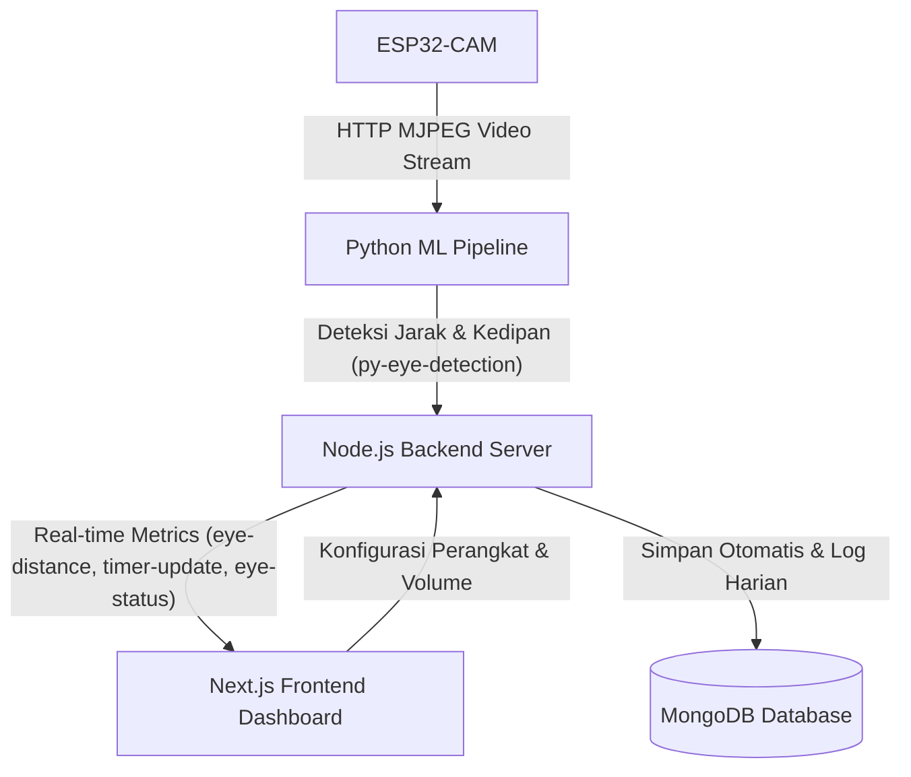

# Product Requirement Document (PRD) - SocaSob

Dokumen Spesifikasi Kebutuhan Produk untuk **SocaSob** (Smart Eye Health Monitoring System).

---

## 1. Identifikasi Dokumen (Document Control)

| Parameter | Keterangan |
|-----------|------------|
| **Nama Proyek** | SocaSob (Smart Eye Health Monitoring System) |
| **Versi Dokumen** | 1.0.0 |
| **Status Dokumen** | Final |
| **Tanggal Pembuatan**| 10 Juli 2026 |
| **Pemilik Produk** | Tim Pengembangan SocaSob |
| **Target Pembaca** | Frontend Developer, Backend Developer, ML Engineer, QA Engineer, Stakeholder |

---

## 2. Ringkasan Eksekutif (Executive Summary)

### 2.1 Latar Belakang Masalah
Dalam era digitalisasi saat ini, sebagian besar pekerja profesional, mahasiswa, pelajar, dan gamer menghabiskan waktu lebih dari 8 jam sehari di depan layar monitor. Kebiasaan menatap layar dalam jangka waktu lama secara terus-menerus sering kali diiringi dengan:
1. Jarak pandang yang terlalu dekat ke layar (kurang dari 30 cm).
2. Kurangnya frekuensi berkedip (menyebabkan mata kering).
3. Jarang melakukan istirahat mata secara berkala.

Hal ini memicu peningkatan risiko gangguan mata seperti **Miopia (rabun jauh)** pada anak-anak/remaja dan **Computer Vision Syndrome (CVS)** atau kelelahan mata ekstrem pada orang dewasa.

### 2.2 Solusi Produk
**SocaSob** adalah sebuah ekosistem pemantauan kesehatan mata cerdas berbasis IoT (Internet of Things) dan Machine Learning. Menggunakan modul kamera nirkabel **ESP32-CAM**, sistem memantau wajah dan mata pengguna secara real-time. Melalui algoritma **MediaPipe Face Mesh**, jarak mata ke layar akan dihitung secara presisi. Data real-time ini disalurkan secara langsung ke dashboard **Next.js Frontend** melalui **WebSockets (Socket.io)**. 

Aplikasi akan memberikan peringatan visual dan audio ketika pengguna berada terlalu dekat dengan layar atau jika sistem mendeteksi tanda-tanda kelelahan mata berdasarkan akumulasi waktu tatap dekat.

---

## 3. Visi & Tujuan Produk (Product Vision & Goals)

### 3.1 Visi
Menjadi solusi IoT kesehatan preventif terdepan yang membantu pengguna komputer menjaga kesehatan mata secara mandiri melalui pendekatan deteksi real-time dan perubahan kebiasaan yang sehat.

### 3.2 Tujuan (Objectives)
* **Pencegahan Miopia:** Memastikan pengguna menjaga jarak aman minimal 30 cm dari layar.
* **Kepatuhan Istirahat (Rest Compliance):** Membantu pengguna mematuhi aturan istirahat mata 20-20-20 (istirahat setiap 20 menit selama 20 detik dengan memandang objek sejauh 20 kaki/6 meter).
* **Kesadaran Pengguna (User Awareness):** Menyediakan visualisasi data historis harian, mingguan, dan bulanan tentang pola penggunaan komputer dan kesehatan mata mereka.

### 3.3 Indikator Keberhasilan (KPI)
* **Akurasi ML:** Deteksi jarak mata (Dekat vs Jauh) oleh model ML memiliki akurasi minimum 92%.
* **Latensi Real-time:** Pengiriman data deteksi dari program Python ke dashboard Next.js memiliki latensi $< 200\text{ ms}$.
* **Penggunaan Aplikasi:** Pengguna aktif harian (DAU) mematuhi batas rekomendasi tatap dekat maksimal 30% dari total waktu kerja harian.

---

## 4. Aliran Sistem & Arsitektur (System Flow & Architecture)

Sistem SocaSob terbagi menjadi empat komponen utama:
1. **Hardware (ESP32-CAM):** Mengambil gambar pengguna dan menyediakan HTTP MJPEG Video Stream.
2. **ML Pipeline (Python):** Mengambil frame stream video, menjalankan MediaPipe Face Mesh, menghitung jarak mata sesungguhnya menggunakan formula optik, dan mengirim status jarak via WebSockets.
3. **Backend Server (Node.js + Socket.io + MongoDB):** Mengelola koneksi klien, menghitung statistik waktu, memperbarui database secara berkala, dan memancarkan data monitoring ke frontend.
4. **Frontend Client (Next.js):** Dashboard interaktif untuk menampilkan metrik secara real-time, grafik riwayat, dan mengontrol preferensi pengguna.

### 4.1 Diagram Aliran Data (Data Flow Diagram)

---

## 5. Fitur Utama & Kebutuhan Fungsional (Functional Requirements)

Kebutuhan fungsional dikelompokkan ke dalam 4 modul utama pada aplikasi Frontend:

### 5.1 Modul 1: Real-time Dashboard & Monitoring (FR-01)
* **FR-01.1: Pemantauan Real-time Timer:**
  * Menampilkan jam, menit, dan detik total durasi monitoring sesi saat ini.
  * Sinkronisasi timer per detik dengan backend server.
* **FR-01.2: Status Jarak Mata:**
  * Menampilkan indikator jarak mata secara real-time: **"Dekat"** (jarak $< 30\text{ cm}$) dan **"Jauh"** (jarak $\ge 30\text{ cm}$).
  * Menampilkan tingkat keyakinan model (confidence score) dalam persentase.
* **FR-01.3: Status Kesehatan Mata:**
  * Menampilkan status mata dinamis berdasarkan algoritma akumulasi waktu:
    * `normal`: Penggunaan layar sehat dengan dominasi tatap jauh.
    * `risk_myopia`: Durasi tatap dekat melebihi 60% dari total waktu berjalan.
    * `risk_fatigue`: Akumulasi waktu monitoring melebihi 1 jam dengan tatap dekat lebih dari 40%.
    * `disconnected`: Koneksi ke robot/kamera terputus.
* **FR-01.4: Indikator Koneksi Robot:**
  * Menampilkan denyut warna (pulse indicator) hijau saat terhubung ke backend server, dan merah jika terputus.

### 5.2 Modul 2: Riwayat Log (FR-02)
* **FR-02.1: Log Harian (Today's Summary):**
  * Menampilkan perbandingan durasi tatap dekat dan tatap jauh dalam satuan menit untuk hari ini.
  * Menampilkan detail jam mulai dan jam berakhir monitoring hari ini.
* **FR-02.2: Log Mingguan (Weekly History):**
  * Menampilkan daftar riwayat pemantauan selama 7 hari terakhir.
  * Setiap entri menampilkan tanggal, status kesehatan mata harian (`normal` / `risk_myopia` / `risk_fatigue`), dan persentase kepatuhan istirahat.
  * Menyediakan tombol ekspansi (expandable) untuk melihat detail log spesifik pada hari tertentu.

### 5.3 Modul 3: Ringkasan Analitik Kesehatan / Resume (FR-03)
* **FR-03.1: Eye Health Score:**
  * Menampilkan nilai kesehatan mata akumulatif dalam skala 0-100 beserta indikator tren (naik/turun/stabil).
* **FR-03.2: Asesmen Risiko (Myopia & Fatigue Risk):**
  * Menampilkan kategori risiko (Rendah, Sedang, Tinggi) beserta rekomendasi klinis/pencegahannya.
* **FR-03.3: Metrik Rata-rata:**
  * Menampilkan jarak rata-rata mata (cm), tingkat kedipan per menit (blink rate), persentase kepatuhan istirahat, dan total jam pemantauan dalam periode 6 bulan.
* **FR-03.4: Grafik Distribusi:**
  * Menampilkan visualisasi persentase waktu tatap dekat vs tatap jauh dalam format grafik lingkaran (doughnut/pie chart).

### 5.4 Modul 4: Pengaturan & Konfigurasi (FR-04)
* **FR-04.1: Koneksi Perangkat:**
  * Input field alamat IP perangkat robot (ESP32-CAM).
  * Tombol **"Hubungkan"** / **"Putuskan"** untuk mengelola koneksi WebSocket.
  * Indikator status koneksi yang menampilkan MAC Address, kekuatan sinyal (RSSI), dan versi firmware perangkat.
* **FR-04.2: Preferensi Audio:**
  * Slider volume suara peringatan (0-100%).
  * Toggle aktif/nonaktif suara peringatan jika mata terdeteksi terlalu dekat.
* **FR-04.3: Preferensi Notifikasi Web:**
  * Toggle aktif/nonaktif notifikasi sistem browser (browser push notifications).
* **FR-04.4: Persistensi Data Pengaturan:**
  * Menyimpan seluruh perubahan pengaturan ke `localStorage` agar tidak hilang saat browser dimuat ulang, serta mensinkronisasikan data tersebut ke database backend.

---

## 6. Spesifikasi Integrasi & API (Integration & API Specification)

### 6.1 Event WebSockets (Socket.io)
Komunikasi dua arah secara real-time dikelola melalui Socket.io:

| Nama Event | Pengirim | Penerima | Payload | Keterangan |
|------------|----------|----------|---------|------------|
| `py-eye-detection` | Python ML | Node.js Server | `{ distance: 'Dekat'\|'Jauh', confidence: number }` | Transmisi deteksi jarak mata |
| `py-blink-detected` | Python ML | Node.js Server | *None* | Deteksi kedipan mata pengguna (opsional) |
| `timer-update` | Node.js Server | Next.js Frontend | `{ hours: number, minutes: number, seconds: number, timestamp: string }` | Update timer deteksi per detik |
| `eye-distance` | Node.js Server | Next.js Frontend | `{ distance: 'Dekat'\|'Jauh', confidence: number, timestamp: string }` | Menyalurkan status jarak mata ke UI |
| `eye-status` | Node.js Server | Next.js Frontend | `{ status: string, score: number, indicators: { eyeFatigue: number, myopiaRisk: number, posureWarning: boolean, blinkRate: number }, timestamp: string }` | Metrik kesehatan mata berkala |

### 6.2 REST API Endpoints

#### 1. Data Monitoring
* **`GET /api/log/today`**
  * Deskripsi: Mengambil rangkuman data monitoring hari ini.
  * Response: Obj berisi tanggal, akumulasi durasi dekat/jauh (menit), dan detail sesi.
* **`GET /api/log/weekly`**
  * Deskripsi: Mengambil riwayat 7 hari terakhir.
  * Query parameters: `startDate`, `endDate`, `userId`.
* **`GET /api/log/:date`**
  * Deskripsi: Mengambil data pada tanggal spesifik (format: YYYY-MM-DD).

#### 2. Analitik & Ringkasan
* **`GET /api/resume`**
  * Deskripsi: Mengambil ringkasan data kesehatan mata 6 bulan terakhir.
  * Response: Berisi status risiko miopia, risiko kelelahan, rata-rata jarak, kepatuhan istirahat, dan distribusi persentase tatap dekat vs jauh.

#### 3. Pengaturan & Perangkat
* **`GET /api/settings`** & **`POST /api/settings`**
  * Deskripsi: Mengambil dan memperbarui konfigurasi preferensi pengguna.
* **`POST /api/robot/connect`**
  * Deskripsi: Menguji koneksi soket ke alamat IP robot/ESP32-CAM.
* **`GET /api/robot/status`** & **`GET /api/robot/health`**
  * Deskripsi: Mengambil informasi kesehatan sistem (uptime, suhu CPU perangkat, kekuatan Wi-Fi, frame rate kamera, akurasi ML model).

---

## 7. Kebutuhan Non-Fungsional (Non-Functional Requirements)

### 7.1 Performa & Skalabilitas (Performance)
* **Inference Rate:** Model ML harus memproses minimal 15-20 frame per detik (fps) untuk menjaga keakuratan peringatan tanpa lag yang mengganggu.
* **Latensi WebSocket:** Pengiriman data event dari backend ke frontend harus di bawah $100\text{ ms}$.
* **Optimasi Client-Side:** Frontend Next.js harus menggunakan pooling koneksi WebSocket yang efisien agar tidak menyebabkan kebocoran memori (memory leak) di tab browser pengguna yang dibiarkan terbuka berjam-jam.

### 7.2 Keamanan & Privasi (Security & Privacy)
* **Proteksi Video Stream:** Aliran video MJPEG dari ESP32-CAM hanya diproses secara lokal di komputer pengguna (sisi Python ML script). Tidak ada data gambar atau video mentah yang dikirimkan ke server backend atau disimpan di database (hanya metrik angka dan string status yang disimpan untuk melindungi privasi pengguna).
* **CORS Policy:** Server backend harus membatasi CORS origin hanya untuk URL resmi frontend (`http://localhost:3000` di lingkungan lokal).
* **Sanitasi Input IP:** Input alamat IP robot pada halaman settings harus divalidasi dengan format IPv4 yang benar sebelum digunakan di sisi backend untuk menghindari serangan SSRF (Server-Side Request Forgery).

### 7.3 Usabilitas & Desain (Usability & Design)
* **Desain UI/UX Premium:** Antarmuka Next.js menggunakan tema gelap (dark mode), perpaduan warna modern (gradient neon blue/green/red), serta transisi animasi halus untuk status indikator.
* **Responsivitas:** Aplikasi harus beradaptasi dengan sempurna pada berbagai perangkat:
  * Mobile (lebar $< 640\text{px}$): Sidebar disembunyikan dalam menu Hamburger.
  * Tablet (lebar $640\text{px} - 1024\text{px}$): Penyesuaian tata letak grid menjadi 1 kolom.
  * Desktop (lebar $> 1024\text{px}$): Sidebar navigasi kiri selalu terlihat tetap (fixed).
* **Aksesibilitas (A11y):** Menggunakan elemen HTML semantik (`<main>`, `<nav>`, `<header>`), kontras teks yang memenuhi standar WCAG AA, dan dukungan pembaca layar (screen reader) via atribut ARIA.

---

## 8. Kriteria Rilis & Rencana Verifikasi (Release Criteria & Verification)

### 8.1 Kriteria Sebelum Rilis (Definition of Done)
1. Seluruh API endpoints terdokumentasi dan teruji mengembalikan data yang valid.
2. Kode frontend bebas dari error linter (`pnpm lint` sukses).
3. Halaman frontend berhasil di-build tanpa error di Next.js (`pnpm build` sukses).
4. Koneksi WebSocket terbukti melakukan auto-reconnect saat backend atau tracker Python sempat dimatikan dan dinyalakan kembali.

### 8.2 Rencana Pengujian (Testing Plan)
* **Pengujian Unit & Integrasi:**
  * Menggunakan skrip `lib/test-socket.ts` untuk mensimulasikan payload pengiriman data status mata ke frontend dan memverifikasi perubahan tampilan UI secara langsung.
* **Pengujian Pengguna (User Testing):**
  * Pengujian jarak fisik sesungguhnya menggunakan penggaris. Saat kepala diposisikan pada jarak $25\text{ cm}$ dari layar monitor, status pada dashboard frontend harus segera berubah menjadi "Dekat" dalam waktu kurang dari 1 detik dan memicu notifikasi peringatan.

---

## 9. Rencana Masa Depan (Future Roadmap)

1. **Gamifikasi Kesehatan Mata:** Menambahkan fitur tantangan harian (misal: "Pertahankan jarak aman selama 3 jam hari ini") dan pemberian badges/poin untuk meningkatkan keterlibatan pengguna.
2. **Dashboard Orang Tua (Parental Control):** Memungkinkan orang tua memantau riwayat kepatuhan mata anak-anak mereka secara remote dari perangkat lain.
3. **Ekspor Data:** Menyediakan fitur unduh laporan mingguan/bulanan dalam format PDF atau CSV untuk konsultasi dengan dokter spesialis mata.
4. **Ekspansi Aplikasi Mobile:** Membangun aplikasi pendamping menggunakan React Native agar notifikasi dapat dikirimkan langsung ke smartphone pengguna.
5. **Peringatan Postur Tubuh (Posture Warning):** Mengintegrasikan deteksi kemiringan bahu dan kepala pada model ML Python untuk mendeteksi posisi duduk bungkuk (slouching).

---
*SocaSob PRD - Versi 1.0.0 - Juli 2026*
